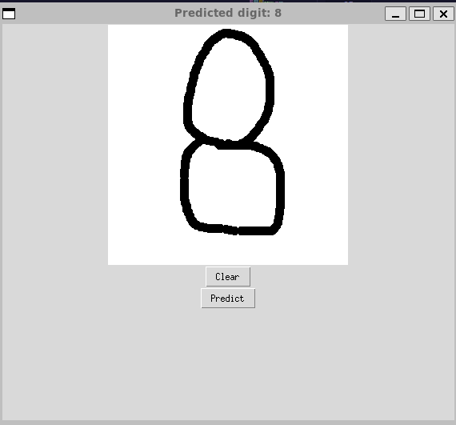

# LeNet-5
Implementación de LeNet-5 en Pytorch para la clasificación de imágenes utilizando la arquitectura clásica de LeNet-5 con siete capas. Entrenado y evaluado en el conjunto de datos MNIST para reconocimiento de dígitos escritos a mano.

## Explicación de la arquitectura
LeNet-5 es una red neuronal convolucional diseñada para el reconocimiento de dígitos. Consta de siete capas, incluyendo capas de convolución, capas de submuestreo (pooling) y capas completamente conectadas. La arquitectura es la siguiente:

1. Capa de convolución C1: 6 filtros de 5x5.
2. Capa de submuestreo S2: 6 filtros de 2x2 con un paso de 2.
3. Capa de convolución C3: 16 filtros de 5x5.
4. Capa de submuestreo S4: 16 filtros de 2x2 con un paso de 2.
5. Capa de convolución C5: 120 filtros de 5x5.
6. Capa completamente conectada F6: 84 neuronas.
7. Capa de salida: 10 neuronas, correspondientes a los dígitos del 0 al 9.

## Dependencias
Para utilizar este proyecto, primero debe crear un entorno virtual con Conda. Puede hacerlo con el siguiente comando:

```bash
conda create -n env_name python=3.11
```

Luego, active el entorno con:

```bash
conda activate env_name
```
### Instalación de PyTorch

Este proyecto requiere PyTorch. Puedes instalar PyTorch siguiendo las instrucciones en la [página oficial de PyTorch](https://pytorch.org/).

Una vez instalado PyTorch, puedes instalar las demás dependencias con:

```bash
pip install -r requirements.txt
```
Finalmente, instala `torch-tb-profiler` con el siguiente comando:

```bash
pip install torch-tb-profiler
```
## Uso

Para ejecutar el script principal con parámetros personalizados, utiliza el siguiente comando:

```bash
python main.py --batch_size <batch_size> --epochs <epochs> --lr <learning_rate>
```
Donde &lt;batch_size&gt;, &lt;epochs&gt; y &lt;learning_rate&gt; deben ser reemplazados por los valores que desees. Por ejemplo, para ejecutar el script con un tamaño de lote de 32, 50 épocas y una tasa de aprendizaje de 0.001, el comando sería:
```bash
python main.py --batch_size 32 --epochs 50 --lr 0.001
```

## Inferencia

Para realizar la inferencia, ejecuta el siguiente comando:

```bash
python inference.py
```
En inference.py debes remplazar el path del modelo por el que hayas entrenado.


Esto abrirá una interfaz gráfica donde puedes escribir el dígito que deseas inferir como se muestra a continuación:


